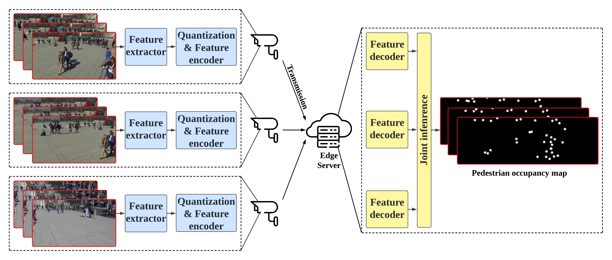

# TOCOM-TEM

This repository is for the [manuscript](https://arxiv.org/abs/2211.14049) "Task-Oriented Communication for Edge Video Analytics".

## Introduction

With the development of artificial intelligence (AI) techniques and the increasing popularity of camera-equipped devices, many edge video analytics applications are emerging, calling for the deployment of computation-intensive AI models at the network edge. Edge inference is a promising solution to move the computation-intensive workloads from low-end devices to a powerful edge server for video analytics, but the device-server communications will remain a bottleneck due to the limited bandwidth. This work proposes a task-oriented communication framework for edge video analytics, where multiple devices collect the visual sensory data and transmit the informative features to an edge server for processing. To enable low-latency inference, this framework removes video redundancy in spatial and temporal domains and transmits minimal information that is essential for the downstream task, rather than reconstructing the videos at the edge server. Specifically, it extracts compact task-relevant features based on the deterministic information bottleneck (IB) principle, which characterizes a tradeoff between the informativeness of the features and the communication cost. As the features of consecutive frames are temporally correlated, we propose a temporal entropy model (TEM) to reduce the bitrate by taking the previous features as side information in feature encoding. To further improve the inference performance, we build a spatial-temporal fusion module at the server to integrate features of the current and previous frames for joint inference. Extensive experiments on video analytics tasks evidence that the proposed framework effectively encodes task-relevant information of video data and achieves a better rate-performance tradeoff than existing methods.




## Experiments

We evaluate the proposed method in the [multi-view pedestrian occupancy prediction task](https://arxiv.org/abs/2007.07247).
Consider an edge server predicts the pedestrian occupancy map based on the images transmitted from multiple cameras.
Our method enables low-latency inference that reduces the communication overhead while maintaining the desired performance.
In particular, we select the multiple object detection accuracy (MODA) as the performance metric.


## Preparation

- We conduct the experiments on the [WILDTRACK dataset](https://www.epfl.ch/labs/cvlab/data/data-wildtrack/).
Download the dataset by using this [link](http://documents.epfl.ch/groups/c/cv/cvlab-unit/www/data/Wildtrack/Wildtrack_dataset_full.zip) (6.3 GB).
We use the first 90% frames for training and the last 10% frames for testing.

- We use [MVDet](https://link.springer.com/chapter/10.1007/978-3-030-58571-6_1) as the backbone of the neural networks.
The [official Pytorch implementation](https://github.com/hou-yz/MVDet) of MVDet made this work possible.


### Packages

- torch, torchvision
- cv2, PIL, matplotlib
- nunmpy, scipy
- tqdm

### Others

- Two GPU cards are required.


## How to run


### Step 1: Feature extraction.


- `cd 1.feature_extraction`

- `CUDA_VISIBLE_DEVICES=0,1 python main_feature_extraction.py --dataset_path /PATH/TO/Wildtrack_dataset --epochs 30 --target_rate 80 --beta 1e-5`

	- The parameter `target_rate` represents the constraint on the communication cost (in the unit of KB).

	- The parameter `dataset_path` specifies the path to the dataset.

	- The model with the maximum MODA value will be saved at `./1.feature_extraction/logs_feature_extraction/...`


#### logs:

```
Training...
Epoch: 1, batch: 20, loss: 0.014577, gt_losses: 0.008856, communication cost: 572.06 KB
Epoch: 1, batch: 40, loss: 0.013828, gt_losses: 0.008738, communication cost: 509.03 KB
Epoch: 1, batch: 60, loss: 0.013457, gt_losses: 0.008689, communication cost: 476.81 KB
Epoch: 1, batch: 80, loss: 0.013053, gt_losses: 0.008490, communication cost: 456.30 KB
Epoch: 1, batch: 100, loss: 0.012798, gt_losses: 0.008377, communication cost: 442.04 KB
Epoch: 1, batch: 120, loss: 0.012698, gt_losses: 0.008388, communication cost: 430.99 KB
Epoch: 1, batch: 140, loss: 0.012464, gt_losses: 0.008247, communication cost: 421.74 KB
Epoch: 1, batch: 160, loss: 0.012250, gt_losses: 0.008116, communication cost: 413.46 KB
Epoch: 1, batch: 180, loss: 0.012114, gt_losses: 0.008052, communication cost: 406.22 KB
Epoch: 1, batch: 200, loss: 0.011842, gt_losses: 0.007851, communication cost: 399.13 KB
Epoch: 1, batch: 220, loss: 0.011715, gt_losses: 0.007785, communication cost: 393.00 KB
Epoch: 1, batch: 240, loss: 0.011611, gt_losses: 0.007735, communication cost: 387.60 KB
Epoch: 1, batch: 260, loss: 0.011452, gt_losses: 0.007630, communication cost: 382.23 KB
Epoch: 1, batch: 280, loss: 0.011324, gt_losses: 0.007551, communication cost: 377.29 KB
Epoch: 1, batch: 300, loss: 0.011252, gt_losses: 0.007525, communication cost: 372.67 KB
Epoch: 1, batch: 320, loss: 0.011153, gt_losses: 0.007470, communication cost: 368.26 KB
Epoch: 1, batch: 340, loss: 0.010996, gt_losses: 0.007360, communication cost: 363.59 KB
Epoch: 1, batch: 360, loss: 0.010898, gt_losses: 0.007308, communication cost: 358.99 KB
Testing...
res_fpath logs_feature_extraction/2023-06-15_20-51-33/test.txt
gt_fpath ../Wildtrack_dataset/gt.txt
moda: 20.80%, modp: 61.29%, precision: 86.94%, recall: 24.47%
Communication cost: 319.57 KB
maximum_MODA is 20.80%
Training...
Epoch: 2, batch: 20, loss: 0.009069, gt_losses: 0.006346, communication cost: 272.28 KB
Epoch: 2, batch: 40, loss: 0.009106, gt_losses: 0.006421, communication cost: 268.49 KB
Epoch: 2, batch: 60, loss: 0.009249, gt_losses: 0.006602, communication cost: 264.67 KB
Epoch: 2, batch: 80, loss: 0.008944, gt_losses: 0.006347, communication cost: 259.70 KB
Epoch: 2, batch: 100, loss: 0.008620, gt_losses: 0.006076, communication cost: 254.39 KB
Epoch: 2, batch: 120, loss: 0.008574, gt_losses: 0.006075, communication cost: 249.85 KB
Epoch: 2, batch: 140, loss: 0.008463, gt_losses: 0.006009, communication cost: 245.47 KB
Epoch: 2, batch: 160, loss: 0.008422, gt_losses: 0.006005, communication cost: 241.67 KB
Epoch: 2, batch: 180, loss: 0.008295, gt_losses: 0.005919, communication cost: 237.60 KB
Epoch: 2, batch: 200, loss: 0.008164, gt_losses: 0.005832, communication cost: 233.28 KB
Epoch: 2, batch: 220, loss: 0.008042, gt_losses: 0.005753, communication cost: 228.87 KB
Epoch: 2, batch: 240, loss: 0.008022, gt_losses: 0.005776, communication cost: 224.65 KB
Epoch: 2, batch: 260, loss: 0.007929, gt_losses: 0.005727, communication cost: 220.26 KB
Epoch: 2, batch: 280, loss: 0.007873, gt_losses: 0.005712, communication cost: 216.09 KB
Epoch: 2, batch: 300, loss: 0.007769, gt_losses: 0.005650, communication cost: 211.89 KB
Epoch: 2, batch: 320, loss: 0.007631, gt_losses: 0.005554, communication cost: 207.69 KB
Epoch: 2, batch: 340, loss: 0.007546, gt_losses: 0.005509, communication cost: 203.64 KB
Epoch: 2, batch: 360, loss: 0.007449, gt_losses: 0.005452, communication cost: 199.63 KB
Testing...
res_fpath logs_feature_extraction/2023-06-15_20-51-33/test.txt
gt_fpath ../Wildtrack_dataset/gt.txt
moda: 47.48%, modp: 69.15%, precision: 88.57%, recall: 54.52%
Communication cost: 124.80 KB
maximum_MODA is 47.48%
```


### Step 2: Train the entropy model and the inference module in parallel.

- `cd 2.coding_and_inference`

- `CUDA_VISIBLE_DEVICES=0,1 python main_coding_and_inference.py --dataset_path /PATH/TO/Wildtrack_dataset --model_path /PATH/TO/PRETRAINED_MODEL_IN_STEP_ONE/ --epochs 10`

	- The parameter `model_path` specifies the specifies the path to the pretrained model after Setp 1.

	- The parameter `dataset_path` specifies the path to the dataset.


#### logs:

```
Training...
Epoch: 1, batch: 20, loss: 0.045181, gt_losses: 0.007314, communication cost: 378.67 KB
Epoch: 1, batch: 40, loss: 0.031825, gt_losses: 0.006384, communication cost: 254.41 KB
Epoch: 1, batch: 60, loss: 0.028159, gt_losses: 0.006084, communication cost: 220.76 KB
Epoch: 1, batch: 80, loss: 0.026011, gt_losses: 0.005722, communication cost: 202.89 KB
Epoch: 1, batch: 100, loss: 0.024368, gt_losses: 0.005447, communication cost: 189.21 KB
Epoch: 1, batch: 120, loss: 0.023107, gt_losses: 0.005286, communication cost: 178.20 KB
Epoch: 1, batch: 140, loss: 0.022082, gt_losses: 0.005147, communication cost: 169.35 KB
Epoch: 1, batch: 160, loss: 0.021204, gt_losses: 0.005008, communication cost: 161.95 KB
Epoch: 1, batch: 180, loss: 0.020420, gt_losses: 0.004842, communication cost: 155.78 KB
Epoch: 1, batch: 200, loss: 0.019809, gt_losses: 0.004753, communication cost: 150.56 KB
Epoch: 1, batch: 220, loss: 0.019292, gt_losses: 0.004677, communication cost: 146.15 KB
Epoch: 1, batch: 240, loss: 0.018881, gt_losses: 0.004643, communication cost: 142.39 KB
Epoch: 1, batch: 260, loss: 0.018399, gt_losses: 0.004516, communication cost: 138.83 KB
Epoch: 1, batch: 280, loss: 0.018034, gt_losses: 0.004454, communication cost: 135.80 KB
Epoch: 1, batch: 300, loss: 0.017695, gt_losses: 0.004394, communication cost: 133.00 KB
Epoch: 1, batch: 320, loss: 0.017369, gt_losses: 0.004331, communication cost: 130.38 KB
Epoch: 1, batch: 340, loss: 0.017071, gt_losses: 0.004269, communication cost: 128.01 KB
Testing...
res_fpath logs/2023-06-15_20-53-29_tau1_0_tau2_1/test.txt
gt_fpath ../Wildtrack_dataset/gt.txt
test gt losses 0.11133081931620836 statistic tensor(29616.6895, device='cuda:0')
moda: 79.36%, modp: 71.20%, precision: 95.58%, recall: 83.21%
Communication cost: 89.92 KB
maximum_MODA is 79.36% minimum_bits_loss 89.92 KB
Training...
Epoch: 2, batch: 20, loss: 0.012770, gt_losses: 0.003795, communication cost: 89.75 KB
Epoch: 2, batch: 40, loss: 0.012219, gt_losses: 0.003410, communication cost: 88.09 KB
Epoch: 2, batch: 60, loss: 0.012165, gt_losses: 0.003400, communication cost: 87.65 KB
Epoch: 2, batch: 80, loss: 0.012033, gt_losses: 0.003348, communication cost: 86.85 KB
Epoch: 2, batch: 100, loss: 0.011940, gt_losses: 0.003322, communication cost: 86.18 KB
Epoch: 2, batch: 120, loss: 0.011835, gt_losses: 0.003268, communication cost: 85.67 KB
Epoch: 2, batch: 140, loss: 0.011937, gt_losses: 0.003391, communication cost: 85.46 KB
Epoch: 2, batch: 160, loss: 0.011868, gt_losses: 0.003359, communication cost: 85.09 KB
Epoch: 2, batch: 180, loss: 0.011680, gt_losses: 0.003245, communication cost: 84.34 KB
Epoch: 2, batch: 200, loss: 0.011541, gt_losses: 0.003167, communication cost: 83.74 KB
Epoch: 2, batch: 220, loss: 0.011435, gt_losses: 0.003111, communication cost: 83.24 KB
Epoch: 2, batch: 240, loss: 0.011370, gt_losses: 0.003094, communication cost: 82.76 KB
Epoch: 2, batch: 260, loss: 0.011310, gt_losses: 0.003069, communication cost: 82.41 KB
Epoch: 2, batch: 280, loss: 0.011253, gt_losses: 0.003055, communication cost: 81.98 KB
Epoch: 2, batch: 300, loss: 0.011191, gt_losses: 0.003028, communication cost: 81.64 KB
Epoch: 2, batch: 320, loss: 0.011090, gt_losses: 0.002974, communication cost: 81.16 KB
Epoch: 2, batch: 340, loss: 0.011073, gt_losses: 0.002973, communication cost: 81.00 KB
Testing...
res_fpath logs/2023-06-15_20-53-29_tau1_0_tau2_1/test.txt
gt_fpath ../Wildtrack_dataset/gt.txt
test gt losses 0.09958255547098815 statistic tensor(13222.7148, device='cuda:0')
moda: 82.25%, modp: 72.80%, precision: 96.83%, recall: 85.03%
Communication cost: 76.82 KB
maximum_MODA is 82.25% minimum_bits_loss 76.82 KB
```


## Citation

```
@article{shao2022task,
  title={Task-Oriented Communication for Edge Video Analytics},
  author={Shao, Jiawei and Zhang, Xinjie and Zhang, Jun},
  journal={arXiv preprint arXiv:2211.14049},
  year={2022}
}
```

## Find our other works on task-oriented communication

- J. Shao, Y. Mao, and J. Zhang, “Learning task-oriented communication for edge inference: An information bottleneck approach,” IEEE J. Select. Areas Commun, vol. 40, no. 1, pp. 197-211, Jan. 2022. [[Arxiv]](https://arxiv.org/abs/2109.00172)[[Code]](https://github.com/shaojiawei07/VL-VFE)

- J. Shao, Y. Mao, and J. Zhang, “Task-oriented communication for multi-device cooperative edge inference,” IEEE Trans. Wireless Commun., vol. 11, no. 1, pp. 73-87, Jan. 2023. [[Arxiv]](https://arxiv.org/abs/2109.00172)[[Code]](https://github.com/shaojiawei07/VDDIB-SR)

